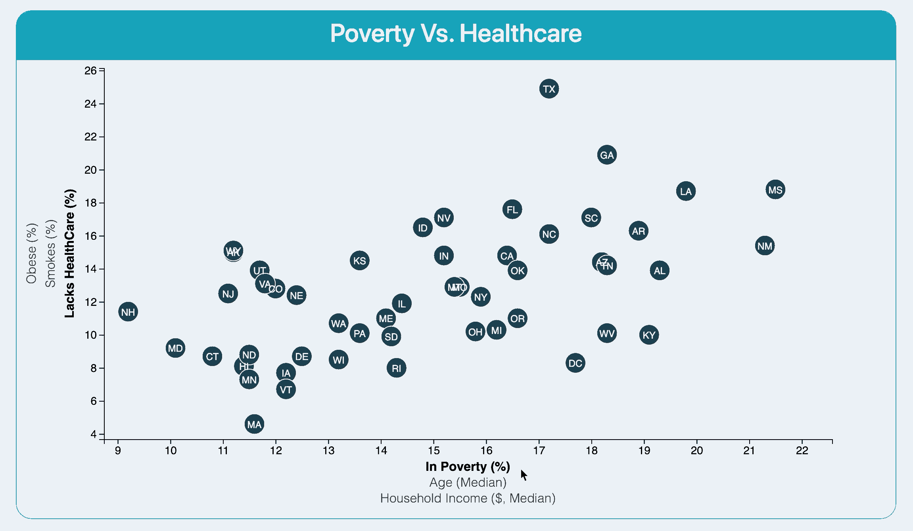

  
  
  

The Data-Journalism project is to create nine different scatter plots within the same chart, using d3 to cross data from health risks and particular demographics in US states.
State abbreviations are included in the circles.
The data are pulled from a csv file using the d3.csv function.
The labels have click events so the user can decide which data to display. The transitions are animated for the circles' locations as well as the range of the axes.
Using the d3-tip.js plugin developed by [Justin Palmer](https://github.com/Caged), tooltips have been added to the circles to be displayed with the data that the user has selected. —we've already included this plugin in your assignment directory.
